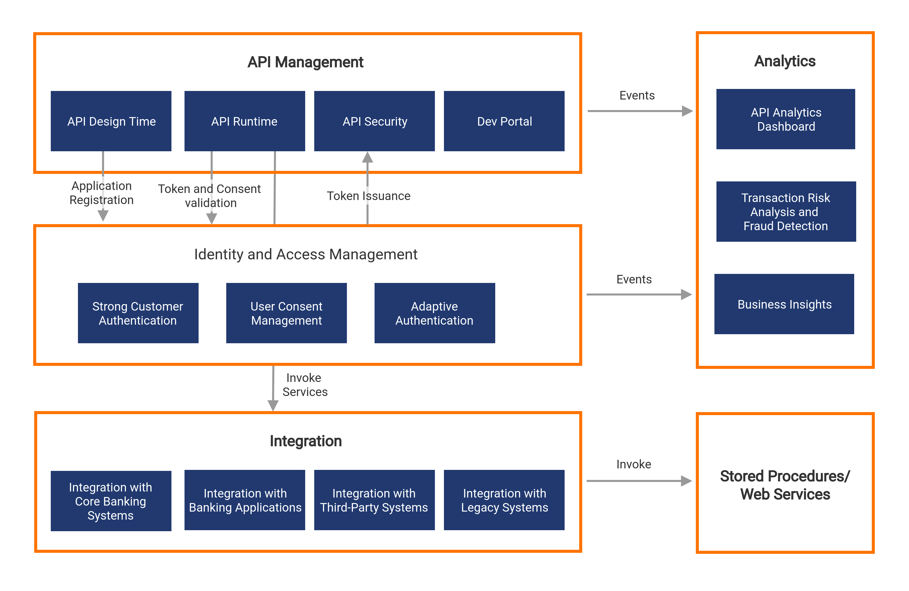

## Overview

WSO2 Open Banking is a purpose built solution for regulatory compliance. It helps align banking and regulatory needs with technology infrastructures and regulatory expertise to quickly satisfy compliance.  It is assembled using a componentized architecture ensuring flexibility to meet different technology use cases. Built on top of a unified integration platform. WSO2 Open Banking helps banks become integration agile for any digital initiative beyond compliance 

WSO2 Open Banking leverages key technology areas critical to a banking infrastructure; API Management, Identity and Access Management, Integration, Analytics and Business Insights, and Fraud Detection bundled together in a componentized architecture. This gives the flexibility to reuse existing infrastructure, and banks only need to obtain the components that are not available in their current infrastructure. 

## API Management
- Support for Open Banking UK, Berlin Group NextGenPSD2, and Australian Consumer Data Standards API specifications
- API Security with OAuth 2.0 and Mutual SSL including the support for PSD2 eIDAS
- API Publishing and Governance
- API Throttling and Rate Limiting
- API Monitoring and Monetization

## Strong Customer Authentication (SCA)
- Multi-Factor Authentication such as SMS OTP, Email OTP, and Biometrics
- Support for OIDC - Dynamic Linking and Hybrid Flow
- Adaptive Authentication

## Consent Management
- Capabilities to store, validate and revoke consents
- Compliant with Open Banking UK, Berlin Group NextGenPSD2, and Australian Consumer Data Standards API specifications

## Integration
- Easy integration with core banking systems
- Support for multiple protocols (REST, SOAP, and WebSocket) and message formats (JSON and XML)

## Third Party Provider Onboarding
- Automatic TPP onboarding
- Workflow-based TPP onboarding

## GDPR Compliance
- Enhancements to consent management, user profile management, forget me, and cookie handling features

## Additional Components
- Risk Management
    - Fraud Detection
    - Transaction Risk Analysis
    - Alerts
